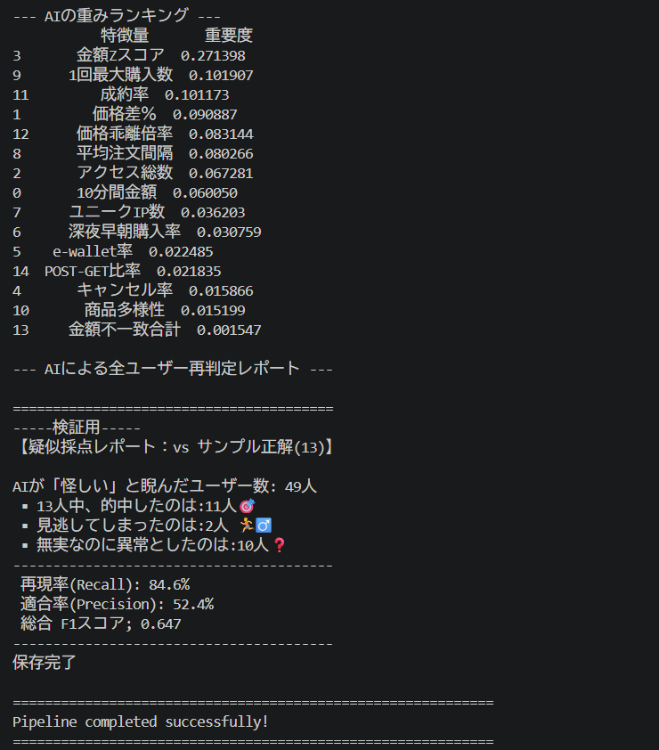

# AI-Powered E-Commerce Anomaly Detection Pipeline

ECサイトにおける不正注文や不正アクセスを検知するための、ハイブリッド型（ルールベース ✕ 機械学習）の異常検知パイプラインです。
大量の注文データ（CSV）およびアクセスログ（JSONL）をパースし、不審な行動パターンを自動的に検出・スコアリングしてレポート（JSON）を出力します。

> **※注記:**
> セキュリティおよび機密保持（NDA）の観点から、検証用の生データセットおよび一部のシェルスクリプトは非公開としています。システムの中核ロジックについては `main.py` および `test-main.py` をご参照ください。

## 実行ログ・評価レポート

*(ターミナル上での実行ログ、およびscikit-learnによるモデルの精度評価結果)*

## 主な機能と技術的特徴

### 1. ハイブリッド検知アーキテクチャ
「ルールベース」「教師あり学習」「半教師あり学習」など複数のアプローチを比較検討した結果、複雑で多様な異常を検知するため、ハイブリッドアーキテクチャを採用しました。
- **統計ルール層:** 注文金額の Z-score（対数変化率ベース）や、10分間の高頻度連打注文など、明確な外れ値を高速に一次フィルタリング。
- **機械学習層:** `RandomForestClassifier` を用い、ルールだけではすり抜ける「複合的な怪しい挙動」を確率（`predict_proba`）で再判定。

## こだわったポイント

- **過学習の防止**  
  AIが学習データにのみ適合してしまいF1スコアが **1.0** になってしまう過学習を防ぐため、検証用スクリプト（`test-main.py`）を作成。ラベル付きデータを学習用とテスト用に分割（`train_test_split`）し、未知のデータに対する汎化性能（F1スコア）をモニタリングしながら、決定木の深さ（`max_depth`）などを慎重に調整しました。

- **Feature Importance に基づく特徴量の最適化**  
  ドメイン知識に基づいて抽出した14種類の特徴量に対し、AIが「どの特徴量を重視して判定しているか（Feature Importance）」を実験を通して分析。ノイズとなる特徴量の削除や、より有効な特徴量の追加を繰り返すイテレーティブなアプローチで精度を向上させました。

  *※主な特徴量の例:*
  - `user_post_get_ratio`: Bot行動を見抜くための、アクセス型とアクション型の比率。
  - `user_avg_order_interval`: 人間では不可能なミリ秒単位の連続購入を検知する平均注文間隔。
  - `user_product_diversity`: 同一商品の機械的購入を見抜く多様性スコア。

- **パイプライン設計による疎結合なアーキテクチャ**  
  システム全体を「Data Loading ➔ Feature Engineering ➔ Hybrid Detection ➔ Output Generation」という明確なフェーズに分離するデザインパターンを採用し、保守性を高めています。

## プロジェクトを通じた考察と学び

本課題を通じて、初めてPythonおよび機械学習（教師あり学習）の実装に挑戦しました。
開発初期は、ブラックボックスになりがちなAIの挙動制御や、データ型の変換、複数ファイル（CSV/JSONL）にまたがるデータフローの設計に苦労しました。しかし、検証環境を構築して数値を可視化し、モデルのパラメータ調整と特徴量エンジニアリングを繰り返すことで、「精度と汎化性能のトレードオフ」という機械学習の難しさと面白さを実践的に学ぶことができ、エンジニアとして非常に有意義な経験となりました。

## 使用技術

### 言語・ライブラリ
- Python 3.x
- scikit-learn (RandomForestClassifier, 精度評価モジュール)
- pandas (データ集計・重み付け処理)
- 標準ライブラリ (math, json, csv, collections, os)

## ディレクトリ構成

```text
anomaly-detection-pipeline/
├── main.py              # 本番実行用のメインパイプラインスクリプト
├── test-main.py         # 精度評価・ハイパーパラメータ調整用の検証スクリプト
├── data/
│   └── input/           # 入力データディレクトリ（※実データは非公開）
└── output/              # 実行結果出力ディレクトリ
```

## 利用方法

### 1. 動作環境の準備
Python 3.x がインストールされている環境で、必要なライブラリをインストールします。

```bash
pip install scikit-learn pandas
```

### 2. パイプラインの実行
ダミーデータ等を `data/input/` に配置した状態で、以下のコマンドで本番用のパイプラインを実行します。

```bash
python main.py
```
※モデルの客観的な精度評価やF1スコアの確認を行いたい場合は `python test-main.py` を実行してください。
