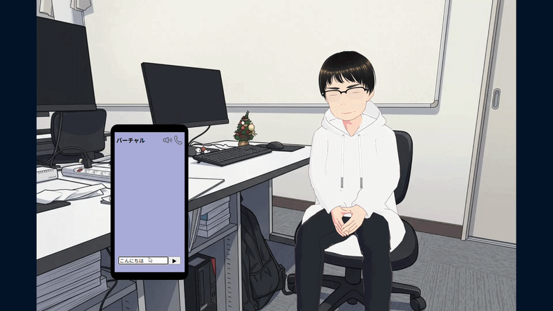

# virtual-chat  
ブラウザ上で自分で作成したVRoidStudioの3Dアバター（VRM）、COEIROINKの音声モデルとリアルタイムに音声・テキストで対話ができる、AIエージェントシステムです。

## デモ動画


## 主な機能と技術的特徴

### 1. ストリーミング応答（バックエンド）
- **Flask (Python)** を用いたストリーミングAPIの構築。
- **Gemini API**（`gemini-flash-latest`）からの逐次出力を一文ごとにパースし、リアルタイムに音声合成APIへ流すパイプラインを設計。
  これにより、長文の返答でも素早い応答を実現。

### 2. ブラウザ上での動的3Dモデル制御（フロントエンド）
- **Three.js** および **@pixiv/three-vrm** を使用し、ブラウザ上での軽量な3Dアバター描画を実現。
- サイン波（`Math.sin`）を用いた自然なアイドリング（呼吸）モーションの実装。
- 「考え中」などの状態に応じた、ランダムなボーン（首・腕・手）の動的ポージング制御。

### 3. Web Audio API によるリアルタイム・リップシンク
- 音声再生時に **Web Audio API（AnalyserNode）** を用いて周波数・音量をリアルタイム解析。
- 解析した音量ボリュームと連動させた口パク機能を実装。

## 使用技術

### フロントエンド
- HTML5 / CSS3
- JavaScript (ES6+ Modules)
- Three.js / @pixiv/three-vrm (3D描画・骨格制御)
- Web Audio API (音声解析・リップシンク)
- Web Speech API (音声認識)

### バックエンド
- Python 3.x
- Flask / Flask-CORS (軽量Webサーバー)
- google-generativeai (Gemini API 連携)
- COEIROINK (音声合成エンジン連携)

## セットアップと起動方法

### 1. 依存ライブラリのインストール
ターミナルで以下のコマンドを実行し、必要なライブラリをインストールしてください。

```bash
pip install flask flask-cors google-generativeai requests python-dotenv
```

### 2. 環境変数の設定
1. ルートディレクトリ（`app.py` がある場所）にある `.env.example` をコピーして、新しく `.env` ファイルを作成します。
2. 作成した `.env` ファイルを開き、ご自身の Gemini API キーを以下のように記述します。

```text
GEMINI_API_KEY=your_api_key_here
```

### 3. アプリケーションの起動
1. ローカル環境で **COEIROINK**（v2対応版）を起動しておきます。
   - ※コエイロインクの本体ダウンロードや詳細な使用方法については、[COEIROINK公式サイト](https://coeiroink.com/)をご参照ください。
2. バックエンドサーバー（Flask）を起動します。ターミナルで以下のコマンドを実行してください。

```bash
python app.py
```

3. ブラウザで `index.html` を開きます。

## こだわったポイント
- **AIの思考や音声合成の処理による待ち時間の削減**
  - バックエンドではストリーミング生成することにより、長い文章でも少しずつ出力し素早い応答を実現しました。
  - フロントエンドでは考え中のポーズをさせることや、予め用意した相槌の音声を再生させることで体感待ち時間を減らす工夫をしました。
- **人間らしさを再現**
  - 3Dアバターのコントロール設計により、モデルとなってもらった人物の癖である「貧乏ゆすり」や「話すときの手振り」を細かく再現しました。
  - プロンプトエンジニアリングによりその人らしい性格を再現しました。
- **滑らかなポーズ遷移**
  - 3Dアバターの状態（通常時・考え中・発話時など）が切り替わる際、値を毎フレームごとに少しずつ目的の数値へと近づける補間処理を行うことにより、滑らかに自然な遷移するように工夫しました。
- **Web Audio APIを用いたリップシンク**
  - 
